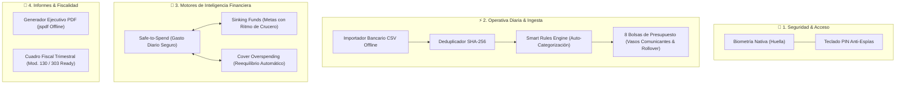

# CronoCash 🪙

> **Bóveda Financiera Inteligente, Control de Gastos & Facturación Autónoma**  
> *100% Local • Cero Fricción • Privacidad Criptográfica Absoluta*

[](CHANGELOG.md)
[](android/app/build.gradle)
[](capacitor.config.ts)
[](docs/FAQ.md)
[](ROADMAP.md)

---

## 🧭 ¿Qué es CronoCash?

**CronoCash** es una aplicación móvil nativa de finanzas personales, presupuestos elásticos por sobres (*"Envelopes"*) y gestión fiscal/facturación desarrollada para ofrecer el máximo control del dinero sin comprometer la privacidad del usuario. 

A diferencia de las soluciones bancarias comerciales basadas en la nube, CronoCash opera **100% en local en el dispositivo**: no requiere cuentas externas, no vende datos a agregadores financieros y no depende de servidores centralizados.

---

## ✨ Características Principales (14 Módulos Maestros)



| Módulo | Descripción Humana | Ventaja Clave |
| :--- | :--- | :--- |
| **1. Seguridad Biométrica & PIN** | Desbloqueo rápido por huella dactilar de Android (`androidx.biometric:1.1.0`), teclado PIN táctil virtual y bloqueo preventivo al minimizar la app (`visibilitychange`). | Máxima protección local contra accesos indebidos. |
| **2. Bolsas de Presupuesto ("Envelopes")** | Reparto en 8 categorías maestras precargadas con filosofía de Presupuesto Base Cero. | Asignación clara de cada euro ingresado. |
| **3. Vasos Comunicantes & Rollover** | Reequilibrio elástico de límites entre bolsas y acumulación automática del superávit de fin de mes hacia el ahorro. | Cero frustración ante desvíos presupuestarios. |
| **4. Gastos Recurrentes & Vampiro** | Control de facturas y suscripciones con cuenta atrás semafórica y detector de gastos zombi con cálculo de ahorro anual. | Eliminación de suscripciones olvidadas. |
| **5. Calendario Reactivo & Cash-Flow Runway** | Visor mensual y semanal ultraligero que anticipa picos de cobros y calcula si llegarás a fin de mes con saldo positivo. | Anticipación a descubiertos bancarios. |
| **6. Notificaciones Exactas Android** | Avisos escalonados a 3 días y el día de cobro de recibos, junto a recordatorio nocturno de cierre a las 21:30. | Puntualidad absoluta en pagos fijos. |
| **7. Google Drive Backup (2 Ranuras)** | Respaldo y restauración transparente mediante Storage Access Framework (SAF) con ranuras canónicas `Actual` y `Previa` con checksum. | Seguridad de datos ante pérdida de móvil sin APIs invasivas. |
| **8. Suite de 14 Consejos Financieros** | Guías de ahorro en luz, seguros, telefonía, dinero extra legal y Escudo Anti-Estafas (CNMV). | Educación financiera aplicable en 1 toque. |
| **9. Grafo de Arquitectura 2D TecnoRed** | Monitor visual interactivo a 60 FPS con física elástica para auditar en tiempo real la salud y latencia del almacenamiento. | Transparencia técnica total in-app. |
| **10. Motor Safe-to-Spend & Cover Overspending** | Cálculo matemático de gasto seguro diario (`netAvailable / daysRemaining`), simulador de compras por impulso y reequilibrio de desvíos en 1 toque. | Saber exactamente cuánto puedes gastar hoy sin culpa. |
| **11. Importador Universal CSV + SHA-256** | Ingesta masiva offline de extractos bancarios (BBVA, Santander, CaixaBank, ING, etc.), descarte de duplicados criptográfico y reglas automáticas. | Eliminación total del tecleo manual diario. |
| **12. Sinking Funds & Ritmo de Crucero** | Planificación de gastos anuales o imprevistos (seguros, IBI, averías, vacaciones) con cuota mensual deducida de forma protegida en el Safe-to-Spend. | Blindaje contra recibos imprevistos de gran cuantía. |
| **13. Informes PDF & Cuadro Fiscal (Mod. 130/303)** | Informes ejecutivos mensuales en PDF de alta fidelidad estética y simulador fiscal trimestral para autónomos y familias con libro de facturas en CSV. | Cierre de ciclo y preparación de impuestos en 1 clic. |
| **14. Centro Acerca de & Novedades** | Historial de versiones explicado para humanos, ficha técnica de la app y conexión con el monitor de salud del stack. | Comprensión inmediata de cada actualización. |

---

## 🛠️ Stack Tecnológico

Basado en la arquitectura ontológica **TecnoRed** de alto rendimiento y cero dependencias innecesarias:

* **UI Runtime:** [React 19](https://react.dev/) + [TypeScript 5.7](https://www.typescriptlang.org/) + [Vite 6](https://vitejs.dev/)
* **Puente Móvil Nativo:** [Capacitor 7](https://capacitorjs.com/) (`@capacitor/android`, `@capacitor/filesystem`, `@capacitor/local-notifications`, `@capacitor/share`)
* **Biometría Nativa:** Plugin Java Jetpack `androidx.biometric:1.1.0` en `MainActivity.java`
* **Persistencia Local ACID:** `IndexedDB v3` nativo con fallback automático y sincronización en `localStorage`
* **Diseño & Sistema de Iconos:** [Tailwind CSS v4](https://tailwindcss.com/) + [Lucide React](https://lucide.dev/)
* **Criptografía & Deduplicación:** Web Crypto API (`crypto.subtle.digest('SHA-256')`)
* **Generación Documental:** `jspdf` para renderizado vectorial offline client-side

---

## 🚀 Inicio Rápido (Entorno de Desarrollo)

### Requisitos Previos
* Node.js v20+ o v22+
* npm v10+
* Android Studio (para desarrollo y emulación móvil) con Android SDK 34+ y JDK 21

### Instalación y Ejecución
```bash
# 1. Clonar el repositorio
git clone https://github.com/DavidLopezGarci4/LTC-Citas.git crono-cash
cd crono-cash

# 2. Instalar dependencias
npm install

# 3. Iniciar servidor de desarrollo Vite
npm run dev

# 4. Compilar bundle web para producción
npm run build
```

---

## 📱 Compilación y Empaquetado Dual de APKs Release

CronoCash cuenta con un pipeline automatizado de compilación que genera **ambas variantes de APK release firmadas** con un único comando:

```bash
npm run build:apk
```

El script `scripts/build-apk.cjs` realiza:
1. Compilación web (`tsc && vite build`) y sincronización con Capacitor (`npx cap sync android`).
2. Sincronización de assets fuera de carpetas con bloqueo de sincronización.
3. Generación y firma de la **Variante Estándar** (`app-v1.13.0-release.apk`) con icono Squircle oficial.
4. Generación y firma de la **Variante Verticons** (`app-v1.13.0-verticon-release.apk`) con tarjeta 2:3 vertical al ras para Microsoft Launcher, Nova y Niagara.
5. Restauración automática de iconos para dejar el repositorio limpio.

Los artefactos se depositan en:
* `android/app/release/app-v1.13.0-release.apk`
* `android/app/release/app-v1.13.0-verticon-release.apk`

---

## 📚 Mapa de Documentación

* 📖 **[Manual de Usuario y FAQ Completo](docs/FAQ.md):** 14 secciones temáticas con respuestas concisas a todas las dudas de uso.
* 🏛️ **[Especificación Arquitectónica](docs/ARCHITECTURE.md):** Diseño técnico detallado de capas, modelos de datos y flujo de información.
* 🗺️ **[Hoja de Ruta (Roadmap)](ROADMAP.md):** Registro de estados y evolución histórica del proyecto.
* 📝 **[Changelog Técnico de Desarrollo](CHANGELOG.md):** Registro de cambios para programadores bajo el estándar Keep a Changelog.
* 🌟 **[Changelog de Usuario (Novedades)](src/config/changelog.user.json):** Manifiesto no técnico que alimenta el modal "Acerca de" dentro de la propia APK.
* 🌐 **[Manifiesto del Stack TecnoRed](src/config/stack.config.json):** Declaración formal de tecnologías para el monitor 2D en tiempo real.

---

## 📄 Licencia y Privacidad

* **Licencia:** Licencia Abierta para Uso Personal y Privado.
* **Compromiso de Privacidad:** Todos los datos permanecen única y exclusivamente en el almacenamiento local del teléfono. CronoCash no incluye rastreadores, ni analíticas de terceros, ni conexiones ocultas.
