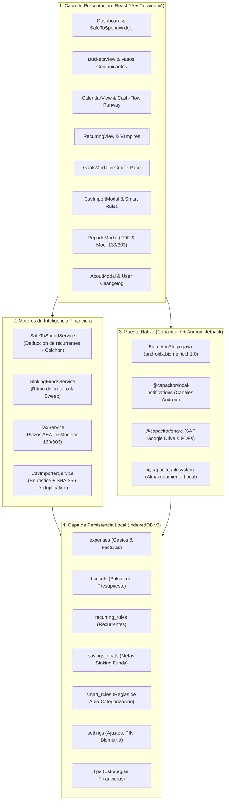

# Arquitectura del Sistema — CronoCash 🏛️

**Versión del Sistema:** v1.13.0 (Build 11300)  
**Marco de Diseño:** Ontología TecnoRed & Arquetipo de Soberanía Local  
**Plataforma Objetivo:** Android Nativo (Capacitor 7) & PWA  

---

## 1. Filosofía Arquitectónica y Principios Rectores

CronoCash está diseñado bajo cuatro principios inmutables:

1. **Soberanía Local de Datos (Offline-First ACID):**  
   Ningún dato financiero, factura, importe o extracto bancario se envía a la nube. Toda la persistencia opera de forma local mediante **IndexedDB nativo (v3)** con fallback y sincronización en espejo a `localStorage`.
2. **Cero Dependencia de Pasarelas Bancarias Centralizadas:**  
   En lugar de depender de APIs de agregación bancaria en la nube (Plaid, Tink, PSD2) que sufren caídas y monetizan con datos de usuarios, CronoCash procesa extractos bancarios en CSV directamente en la memoria del cliente utilizando parsers heurísticos y hashes criptográficos SHA-256.
3. **Presupuesto Base Cero Elástico:**  
   Cada euro ingresado se asigna a una bolsa de gasto o meta de ahorro. Cuando surge un desvío o imprevisto, los módulos de *Vasos Comunicantes* y *Cover Overspending* reequilibran el sistema entre sobres sin alterar el presupuesto global.
4. **Rendimiento Reactivo a 60 FPS:**  
   Las interfaces pesadas (como el grafo Canvas 2D de arquitectura o el generador vectorial de PDFs) utilizan técnicas de carga diferida (`React.lazy` y `<Suspense>`) para mantener el tamaño inicial del bundle en márgenes ultra-optimizados.

---

## 2. Diagrama de Capas del Sistema

---

## 3. Esquema de Datos y Almacenes IndexedDB (v3)

La base de datos `GastosDB` opera bajo la versión canónica 3 con siete *Object Stores* independientes:

### A. `expenses` (Movimientos y Facturas)
* `id`: Clave primaria (`string`, ej: `exp_172737...`).
* `title`: Concepto descriptivo del gasto.
* `amount`: Importe numérico positivo.
* `date`: Fecha en formato ISO (`YYYY-MM-DD`).
* `bucketId`: Identificador de la bolsa asignada.
* `isInvoice`: Booleano que determina si cuenta con justificante fiscal o factura oficial desgravable.
* `invoiceNumber`: Número de factura formal (si aplica).
* `supplier`: Comercio, acreedor o emisor de la factura.
* `taxRate`: Porcentaje de IVA aplicable (21%, 10%, 4%, 0%).
* `taxAmount`: Cuota calculada de IVA soportado.
* `status`: Estado del pago (`'paid'` | `'pending'`).
* `recurringRuleId`: Vinculación a regla recurrente (si fue generado automáticamente).
* `rawHash`: Hash criptográfico SHA-256 para evitar duplicados en importaciones bancarias masivas.
* `importBatchId`: Identificador del lote de importación bancaria para trazabilidad.

### B. `buckets` (Bolsas de Presupuesto / Envelopes)
* `id`: Clave primaria.
* `name`: Nombre descriptivo (ej: "Vivienda", "Supermercado").
* `budgetLimit`: Límite máximo mensual asignado.
* `color`: Código hexadecimal de acento visual.
* `icon`: Nombre del glifo en `lucide-react`.
* `isBuffer`: Booleano que define si la bolsa actúa como amortiguador de emergencias (aislada del cómputo diario en Safe-to-Spend).

### C. `recurring_rules` (Gastos Recurrentes)
* `id`: Clave primaria.
* `title`: Nombre del servicio o suministro.
* `amount`: Importe estimado del recibo.
* `bucketId`: Bolsa presupuestaria a la que se cargará.
* `frequency`: Periodicidad (`'weekly'` | `'monthly'` | `'quarterly'` | `'yearly'`).
* `dayOfMonth`: Día del mes de cargo (1 - 31).
* `isActive`: Estado operativo de la regla.
* `isVampire`: Marcador de suscripción potencialmente innecesaria o poco aprovechada.

### D. `smart_rules` (Reglas de Auto-Categorización)
* `id`: Clave primaria.
* `pattern`: Cadena o palabra clave (ej. `"MERCADONA"`, `"REPSOL"`).
* `matchType`: Tipo de evaluación (`'contains'` | `'exact'` | `'startsWith'` | `'regex'`).
* `bucketId`: Bolsa asignada automáticamente al coincidir.
* `priority`: Número entero de precedencia (menor número = mayor prioridad).
* `isActive`: Interruptor de activación.

### E. `savings_goals` (Metas de Ahorro / Sinking Funds)
* `id`: Clave primaria.
* `title`: Nombre de la meta (ej. "Seguro Anual Coche", "IBI").
* `targetAmount`: Importe objetivo final a acumular.
* `currentAmount`: Saldo aportado hasta la fecha.
* `targetDate`: Fecha límite del desembolso (`YYYY-MM-DD`).
* `category`: Categoría (`'essential'` | `'maintenance'` | `'lifestyle'` | `'emergency'`).
* `priority`: Nivel de prelación de 1 (alta) a 3 (baja) para el algoritmo de barrido de superávit.
* `autoDeductFromSafeToSpend`: Booleano que protege la cuota de crucero mensual dentro del disponible diario.
* `contributions`: Array con el historial auditable de aportaciones individuales con origen y fecha.

---

## 4. Algoritmos Matemáticos Centrales

### 1. Motor Safe-to-Spend (Gasto Seguro Diario)
Calcula en tiempo real el dinero que el usuario puede gastar cada día sin poner en peligro sus compromisos ni tocar su ahorro:
$$\text{compromisos\_pendientes} = \sum \text{recibos\_mes\_sin\_pagar}$$
$$\text{cuota\_sinking\_funds} = \sum \text{metas\_crucero\_protegidas}$$
$$\text{colchón\_blindado} = \sum \text{límite\_bolsas\_buffer}$$
$$\text{netAvailable} = \max\Big(0, \text{ingresos} - \text{gastos\_pagados} - \text{compromisos\_pendientes} - \text{colchón\_blindado} - \text{cuota\_sinking\_funds}\Big)$$
$$\text{dailySafeToSpend} = \frac{\text{netAvailable}}{\text{días\_restantes\_del\_mes}}$$

### 2. Algoritmo de Ritmo de Crucero en Metas (Sinking Funds)
Calcula la aportación mensual constante requerida para alcanzar el importe deseado en la fecha límite:
$$\text{meses\_restantes} = \max\Big(1, \text{mesesEntre}(\text{fecha\_actual}, \text{targetDate})\Big)$$
$$\text{cuota\_mensual} = \frac{\text{targetAmount} - \text{currentAmount}}{\text{meses\_restantes}}$$

### 3. Deduplicador Criptográfico SHA-256
Para cada fila leída de un extracto bancario CSV:
$$\text{hash} = \text{SHA256}\Big(\text{fecha\_normalizada} + "|" + \text{concepto\_normalizado} + "|" + \text{importe}\Big)$$
Se consulta en IndexedDB si existe algún registro previo con ese `rawHash`. Si coincide, se descarta silenciosamente para prevenir cobros fantasma o importaciones solapadas.

### 4. Cuadro Fiscal Trimestral (Modelos 130 & 303 de la AEAT)
* **Modelo 130 (IRPF Fraccionado al 20%):**
  $$\text{Rendimiento Neto} = \text{Ingresos Computables} - \sum \text{Gastos con Factura}$$
  $$\text{Pago a Cuenta (Casilla 07)} = \max\Big(0, \text{Rendimiento Neto} \times 0.20\Big)$$
* **Modelo 303 (Liquidación de IVA):**
  $$\text{Resultado IVA} = \sum \text{IVA Repercutido (21\%)} - \sum \text{IVA Soportado (Facturas Recibidas)}$$

---

## 5. Estrategia de Copias de Seguridad (2 Ranuras SAF)

Para garantizar la inmunidad ante fallos de hardware o cambio de teléfono sin exponer claves OAuth sensibles:
1. **Ranura Canónica 1 (`CronoCash_Actual.json`):** Almacena el estado completo de la base de datos con envelope versionado (`version: "1.13.0"`), fecha ISO y checksum determinista.
2. **Ranura Canónica 2 (`CronoCash_Previa.json`):** Copia de seguridad congelada del estado inmediatamente anterior para permitir vuelta atrás (*rollback*).
3. **Paso por Storage Access Framework (SAF):** En Android, `@capacitor/share` invoca la hoja nativa del sistema operativo, permitiendo al usuario guardar el archivo directamente en su unidad personal de Google Drive, Nextcloud, tarjeta SD o carpeta local.
4. **Comparador Lado a Lado (Side-by-Side):** Antes de restaurar una copia, el sistema analiza el archivo y presenta una tabla comparativa con los deltas de registros (+/-) requiriendo confirmación explícita para evitar pérdidas involuntarias de datos.
